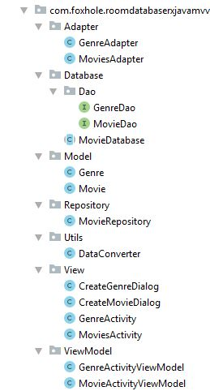

# RoomDatabase-RxJava-MVVM-MutipleTable

This is a android app practice project. I have implemented here Rx JAVA using android MVVM architecture pattern using Room Database MutipleTable.

## Used Component
-RecyclerView And CardView  
-Room Database  
-AndroidX  
-ViewModel and LiveData  
-RXJava  
-Used language Java

## App overview 

## Project Structure 

